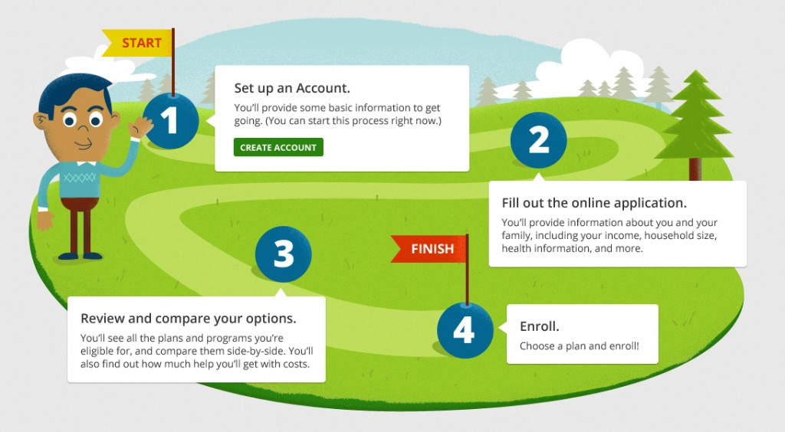

---

layout: interior-post

title: Illustration

categories: visual-design

categoryheader: no

tags:
- Visual Design

--- 

<strong>Usage</strong> 
Custom illustrations provide additional visual continuity between the Learn and Marketplace sides of healthcare.gov.

On the Learn side, illustrations can be found on audience landing pages and the Marketplace Gateway. Illustrations can help explain complicated subjects, processes, and data in an easily digestible, visually engaging way. Accordingly, illustration is used for infographics, charts, and graphs. On occasion, illustration can be used as an alternative to photography. Because an illustration is often the main visual on the page, the illustration must be powerful and purposeful. To prevent the site from appearing overly-saturated with illustration, there should generally be no more than two illustrations on a page.

The Marketplace primarily makes use of illustration on introductory content cards. Specifically, illustration can be found on “chapter” cards of the application introduce a new section. Illustration is strategically used to provide a refreshing visual “break” for the user, who has spent the majority of their time in the application with more utilitarian cards. The vibrant, fun illustrations on these chapter cards not only disarm the user from the start (who may be feeling overwhelmed by the process), but also reassure them that they are making progress.

<strong>Style</strong> 
The style of illustrations on healthcare.gov should be vibrant, bold, welcoming, and sophisticated. The illustrations should not feel overly elementary or “cute-sy,” as that style would risk of “dumbing down” the site, leaving the user feeling insulted. Illustrations should be the most colorful, lively design element on the page. Though primarily flat in style, they offer a hint of dimension to the page through the use of overlaying colors and subtle textures.

The illustrations on the “Learn” side and the Marketplace must follow the same visual style to ensure that the user has the same visual experience throughout the site. In fact, we strongly recommend that illustration assets be shared between the two sides for visual consistency.

<a href="/visual-design/next-steps/" title="Next Steps"><button type="button" class="btn btn-large">Next: Next Steps</button></a>

<!-- .entry-content -->
<footer class="entry-meta">
</footer><!-- .entry-meta -->

