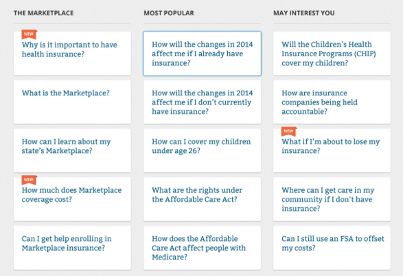
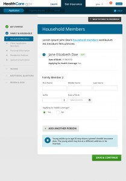

---

layout: interior-post

title: Layout

categories: visual-design

categoryheader: no

tags:
- Visual Design

--- 

In support of the design principle of simplicity, the layout of healthcare.gov should feel open, clean and well-organized, and most importantly support the content on the page. To effectively accomplish this, the layout should serve as a non-distracting design element and intelligently lead the user down the page.

<strong>Healthcare.gov strategically makes use of 2 primary layout techniques to achieve this:</strong>

<strong>Card Motif</strong> 
A white “card” motif is used extensively throughout healthcare.gov. The white cards strategically present digestible “chunks” of information within a page. They also help the user distinguish between different “groups” of information.

<strong></strong>

On the “Learn” side, the card motif is primarily used on the Topics-based pages. Individual cards are used to present individual topics as well as individual articles. When visiting the these specific pages, the user is immediately able to get a sense of how many topics are available, and after clicking through, how many articles are available on a particular topic simply by glancing at the page.

In the Marketplace, individual cards represent a separate step in the application process, a unique task for the user to complete, and individual health care plans in the Plan Compare section. Because the process of applying for coverage and browsing through eligible plans can at times be complicated and overwhelming, the card-based layout offers a less daunting user experience by presenting information in a simple, easy-to-digest way. Suddenly, what could be a 2-hour application process seems a little less arduous simply by the method of presentation. In addition, the subtle sliding vertical animations of the cards (namely in the application process), add both an element of “lightness” to the experience as well as a concrete visual indicator that a step has been successfully completed. In combination, this was strategically implemented to give the user a continual sense of satisfaction throughout the process.

In all cases, the cards are extremely dependent on the negative space technique in order to be effective.

<strong>Negative Space</strong> 
Negative space is used on healthcare.gov as a subconscious visual guide that gives the user important feedback on what items on the screen are the most important. Simply put, the more an item stands alone, the more attention it is going to get. Additionally, negative space is used to group similar bits of information together which helps to solidify the structure of a design. The empty space between these information groups gives our eyes and brains a needed break from information. This helps the design feel clutter-free and organized.

As mentioned in the description of the card motif technique, without negative space, the card motif would fail, as it would be impossible to distinguish between groups of information. The framework color palette is critical to establishing negative space in the design. Throughout healthcare.gov, negative space is primarily defined by the textured light gray background, which allows the white cards and other design elements such as imagery and functional controls to be true focal points of the page.

<a href="/visual-design/photography/" title="Photography"><button type="button" class="btn btn-large">Next: Photography</button></a>
