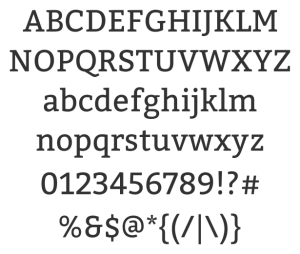
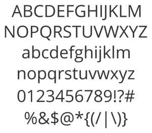

---

layout: interior-post

title: Typography

categories: visual-design

categoryheader: no

tags:
- Visual Design

--- 

Designs that have been stripped of all the unnecessary bells and whistles to place extra emphasis on the content. Naturally, this magnifies the importance of well thought out typography. With fewer distractions for the user, the text must maintain attention and lead the user down the page.

<strong>Healthcare.gov utilizes 2 main families of typography:</strong>

<strong></strong>

<strong>Bitter (slab serif)</strong> 
Bitter, a slab serif, offers an approachable, personality-filled style, which is a nice juxtaposition with the more formal sans-serif. Accordingly, Bitter is used to introduce sections of content on the site and is exclusively reserved for major headlines on healthcare.gov. Strategically, we want the user to initially be attracted to these friendly-feeling headlines, and then once we have their attention, draw them into the details with the highly-legible sans-serif. Bitter is used more frequently on the “Learn” side of healthcare.gov, and is used on the Marketplace side to introduce major sections of the application.

&nbsp;

<strong></strong>

<strong>Open Sans (sans-serif)</strong> 
Open Sans serves as the base font for the site. The full Open Sans type family consists of a variety of weights including light, regular, semibold, bold, and extrabold which allows for a wide range of type treatments and hierarchies within a page while still maintaining a unified look and feel. Whereas Bitter is used to introduce sections of content on the site, Open Sans is used to present the content details. Strategically-speaking, if the user has reached the details, they most likely are engaged at a higher level of attention, so the text must be as legible as possible. Sans-serifs have been proven to be easier to read on-screen and are incredibly adaptable when resized and displayed across different platforms and browsers. Accordingly, Open Sans is used for body type, secondary and tertiary headlines, and instructional text.

<a href="/visual-design/layout/" title="Layout"><button type="button" class="btn btn-large">Next: Layout</button></a>
