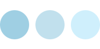
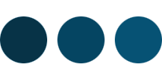
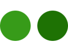
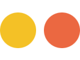
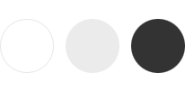

---

layout: interior-post

title: Color Palette

categories: visual-design

categoryheader: no

tags:
- Visual Design

--- 

Healthcare.gov utilizes a simple, minimalist color palette. Shades of blue dominate the palette, providing a neutral canvas on which energetic greens, fresh citrus tones, vibrant imagery, and bright white content areas “pop” on the page.

<h2><strong>Base Color Palette</strong></h2>

Blue serves as the primary base color for healthcare.gov. Blue was specifically selected because it is often associated with depth and stability. According to basic color theory, blue symbolizes trust, confidence, and sincerity. &nbsp;Blue is also used extensively to represent calmness and responsibility.

<strong>Healthcare.gov makes use of a broad spectrum of blues. Each shade of blue is used for a specific purpose:</strong>

<strong>Light Blues</strong> 
Light blues are understanding and friendly. They provide a sense of calm and compassion in the overall design. Light blues are used extensively on the “Learn” side of healthcare.gov and in specific cases such as “helpful hints” and informational alerts on the Marketplace side to soothe the user’s defenses and build trust.

<strong>Medium Blues</strong> 
Bright, medium blues are energizing and refreshing. Medium blues are the dominant color on the “Learn” side of healthcare.gov to encourage an active learning environment as the user explores the main landing pages and dives into specific article pages. Medium blues are also used on the Marketplace side for progress and status indicators as well as secondary actions.

<strong>Dark Blues</strong> 
Dark blues are strong and reliable. They are used most extensively in the Marketplace on “guiding” screens to instill confidence and stability. Since the Marketplace experience requires a high-level of engagement for the user, the dark blue “guiding” screens provide respite for the user by conveying a sense of “we know where you are in the process and we will help you get to the next step.”

<h2>Accent Color Palette</h2>

Following minimalist design principles, accent colors on healthcare.gov are used to capture the viewer’s attention and highlight the most important features on a page. A properly used accent color will be used sparingly and never draw the user’s eye to more than one bit of information at a time.

<strong>Healthcare.gov makes use of 2 primary accent colors. &nbsp;Each accent color is used for a specific purpose:</strong>

<strong>Bright Greens</strong> 
Green represents new beginnings and growth. Bright greens specifically are energizing and vibrant. Accordingly, bright greens are used to indicate calls-to-action and next steps in a process. &nbsp;Primary buttons on healthcare.gov exclusively use green.

<strong>Yellows and Oranges</strong> 
Yellows and Oranges are vibrant and energetic colors. Because of their association with the changing seasons, yellows and orange can represent change and movement in general. &nbsp;The specific shades of yellow and orange used in healthcare.gov leans more toward the “citrus” spectrum which helps convey a sense of “freshness.” Accordingly, yellow and orange are used on Healthcare.gov to signify “observe with special attention.” Yellow is used to indicate user feedback and engagement opportunities. &nbsp;Orange is specifically used for “new” flags and important alerts.

<h2><strong>Framework Color Palette</strong></h2>

Grays and white play an important role in the Healthcare.gov palette. &nbsp;While they serve mostly as framework colors, they do provide a background on which the base and accent colors of Healthcare.gov thrive.

<strong>Light Grays</strong> 
Shades of light gray are used as the site background to bring a certain softness to the design. The subtle texture of grays provide a welcome contrast to the flat punches of the base and accent colors used in the design. The light tones provide a tranquil backdrop that allow the user to focus on the bright white main content areas of the page.

<strong>Dark Grays</strong> 
Dark gray is used for body copy on the page. &nbsp;It is not as harsh as black, so it provides a more friendly, approachable tone.

<strong>White</strong> 
White is used as the background color for the main content areas on healthcare.gov. A stark white background provides a high contrast backdrop for the dark gray text for utmost legibility.

<a href="/visual-design/typography/" title="Typography"><button type="button" class="btn btn-large">Next: Typography</button></a>
