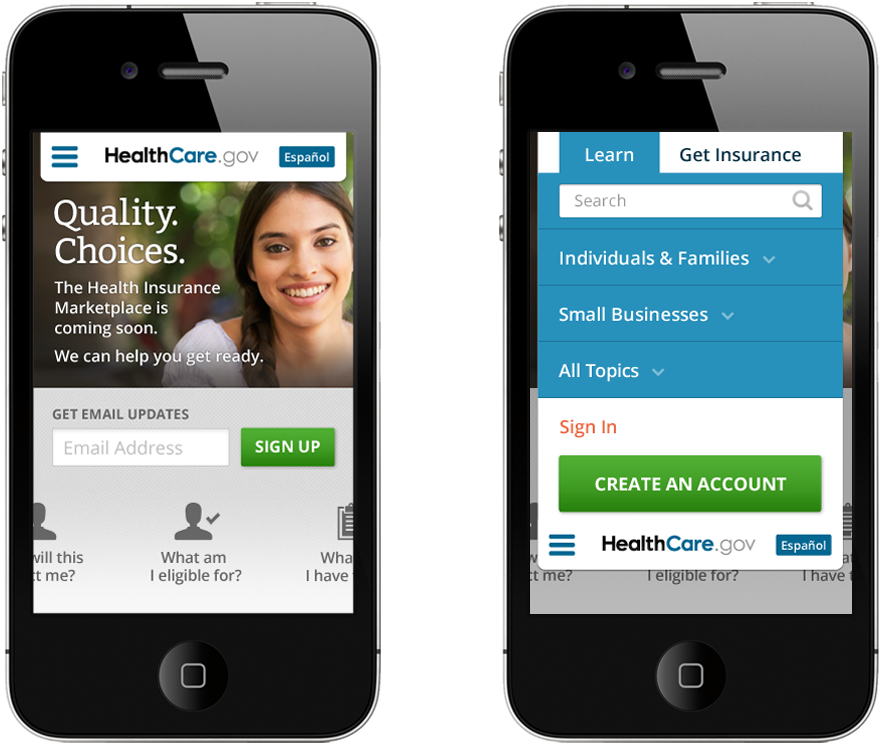

---

layout: interior-post

title: Visual Design Principles

categories: visual-design

categoryheader: no

tags:
- Visual Design

--- 

<h3 class="principle">Build trust.</h3>

Why do people develop trust with a website? Because they believe the site shares their values, interests, needs, and goals. They believe the site understands them and tells them the truth.

We know that most of the uninsured who come to our site want to get insured as quickly and easily as possible. We know they are afraid of expense, complexity, and possibly making a bad decision. We know some of them wonder whether they should bother to get insured at all. We must convey that we understand these needs and concerns, and that we can help them make decisions that are right for them.

The visual personality of the site is essential to this effort. It must convey compassion, warmth, and understanding. The site must look and feel trust-worthy.

<h3 class="principle">Simplicity</h3>

The second principle of our visual design is SIMPLICITY. The simpler we make the site, the more easily we can direct a user’s attention to the content or step most useful to them. By using a clean, uncomplicated design, we create a site that is easy to scan, read, and interact with. Once again, this helps convey trust in our ability to help them.

<a href="#TbsCollapseGroupId-1725729692" data-parent="#TbsCollapseId-1076150842" data-toggle="collapse" class="accordion-toggle">
Examples of simplicity				</a>

<h4>Navigation</h4>

A consistent two-tab approach is used to keep choices few and clear: Learn or Get Insurance. Other components have been placed according to usability best practices, such as the logo linking to the home page, the search field placed in the top right, and the En Espanol link in the upper right hand corner. Personal account settings and mail functionality are intentionally styled to look like those found on social media sites like Facebook. These simple treatments are already familiar to many users, creating a level of comfort.

<h4>Layout &amp; Content</h4>

A clear layout design that easily conveys content is imperative. For example on the home page, the open and airy feel of the layout complements the clean, crisp design of the header. The photo is simple and compelling. It establishes an emotional connection but does not distract the user from the message. The copy to the left is simple and clear, as is the call to action.

The home page brings users’ primary tasks directly to the forefront via a swipe-able slider. The tasks are voiced as common questions, based on extensive user research. This helps the user feel we understand their needs, again reinforcing trust. The questions are supported with icons styled to reflect an application-like feel. This slider can be navigated using the arrows on either end, or tabbed through for accessibility and 508 compliance.

Focus is brought to the “Sign Up” call to action with a simple text field and a single green button. This area is free of distraction, putting the focus on the desired action.

<h4>Photography</h4>

The photography, like the site itself, is simple, friendly, and uncluttered. Comfortable and light in feeling, this simplicity adds air to the layout and promotes a positive user experience.

<h3 class="principle">User Experience</h3>

In order to promote a positive user experience, we maintain ease of use throughout the site. On the Learn side, we keep content clear, concise and easily accessible. On the Marketplace side, we cut out the clutter and simplify the tasks the user needs to accomplish. The user is guided throughout the process.

Other usability findings and guidelines have been implemented in the site design, including:

<ul>
<ul>
<li dir="ltr">Form labels above the field</li>
<li dir="ltr">Users focus on faces</li>
<li dir="ltr">Quality of design is an indicator of credibility</li>
<li dir="ltr">White space improves comprehension</li>
</ul>
</ul>

<a href="#TbsCollapseGroupId-187060056" data-parent="#TbsCollapseId-1005513380" data-toggle="collapse" class="accordion-toggle">
Examples of user experience				</a>

<h4>Accessibility</h4>

Mobile visits now account for about 20% of traffic to healthcare.gov, and the growth is accelerating. With this in mind, we focused on designing for the web, not for the device.

The Learn side of the site and the Marketplace Gateway page are designed to be responsive. This ensures that the user can access the content on these sections regardless of the device they use. A good mobile experience once again helps build trust&ndash;it shows we’ve made efforts to accommodate the way users access information.

<h4>Mobile Experience</h4>

Even though responsive web design allows users access to the same content, the experience can be very different on a mobile device with a small screen (like a smartphone). To offer a more consistent, user-friendly experience, we applied usability best practices for small devices accessing the web.

<ul>
<li><strong>Button/Link Placement &amp; Size:&nbsp;</strong>Buttons have been sized to accommodate typical fingertips. Adequate space between links is important to ensure that an unintentional selection is not made.</li>
<li><strong>Navigation:</strong> The main navigation is sticky for ease of use. The use of the common three-bar menu icon is standard on mobile devices. The menu expands like a window shade, revealing the hidden menu without making the user feel they have left the page. This functionality carries the same styling as the desktop site, but is neatly compacted to allow the user to access it only when needed.</li>
<li>

<strong>Performance &amp; Conditional Loading:</strong> Viewing a “super footer” on a desktop monitor is very different than wanting to view it all on a mobile device. To allow the same content accessibility without creating performance issues on a mobile device, we recommend conditional loading.

In this example, conditional loading shows only the essential content of the footer. If the user would like to access more content, they would click the link to call the other content for that section of the footer. This follows the “bite/snack/meal” content approach used throughout the site. By not including everything, we are able to ensure faster page loading while still providing access to all less essential content and functionality.

</li>
</ul>
<h4>508 Compliance</h4>

Content access by those with disabilities has been taken into consideration. Maintaining contrast, legibility, and access to content through keyboard functionality was included in the design of the site.

<h4>Brand Consistency</h4>

Because the site is divided into a Learn side and a Marketplace site, brand consistency is a key principle. People have to feel they are on the same site regardless of which side they are on. To achieve this, a number of visual elements are shared on both sides, including the header, color palette, simplified and airy approach, photo style, use of icons, and use of a “card” motif for content.

<a href="/visual-design/color-palette/" title="Color Palette"><button type="button" class="btn">Next: Color Palette</button></a>				

<a title="Color Palette" href="/visual-design/color-palette/"><button type="button" class="btn btn-large">Next: Color Palette</button></a>
